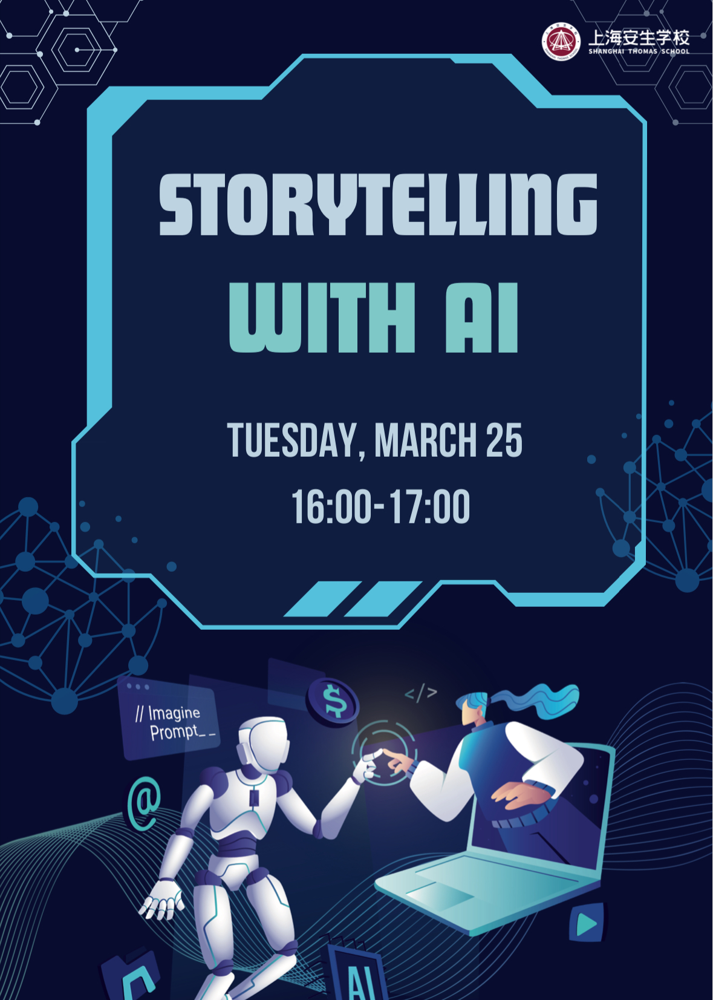

# storytelling-with-ai
# 📖 AI Storytelling App


An interactive AI-powered storytelling tool designed for middle school students. It helps students generate creative short stories using AI. The app was created for a "Storytelling with AI" event I held at Shanghai Thomas School, a bilingual educational institution in China.

## 🚀 Features
✅ Generate AI-powered stories using **OpenAI GPT-4o**  
✅ **User-friendly UI** with a clean and engaging design  
✅ **Simple English** to help non-native speakers  
✅ **Download stories as TXT files**  
✅ **Extract key vocabulary and translations** for learning  
 

## 🎮 How to Use
1. Enter **story details** in the sidebar (Setting, Style, Characters, Main Event).
2. Click **"Set Story Details"** to save your inputs.
3. Click **"Write Story"** to generate an AI-created short story.
4. Click **"Show Keywords & Translations"** to extract key vocabulary.
5. Click **"Download Story as TXT"** to save it.

## 🛠️ Installation & Running Locally

1. Clone the repository:
   ```bash
   git clone https://github.com/nadiaurban/storytelling-with-ai.git
   cd storytelling-with-ai

